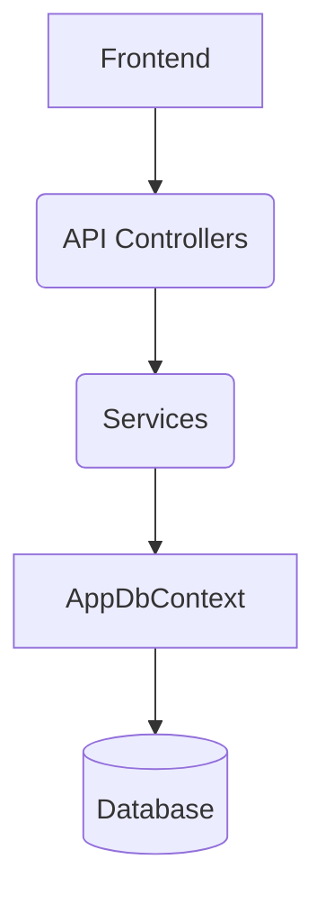
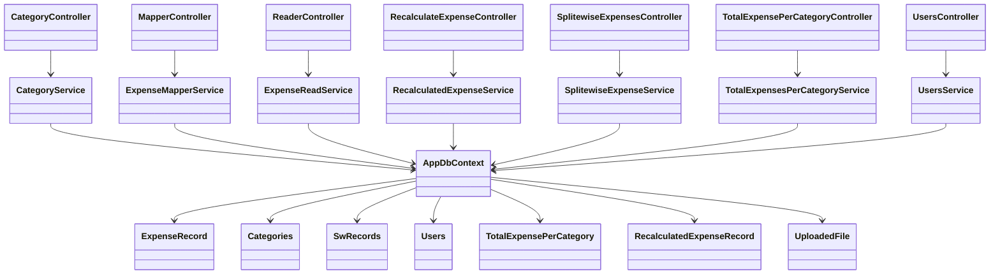

# ExpensesManager

App for handling expenses on a monthly basis -  mapping, storing and categorizing the expenses

### Demo

[Expenser.webm](https://github.com/roeezach/ExpenseManager-WebAPI/assets/106396740/e0174c6b-f2f0-4604-8295-21cf51bab15b)

## App Structure

The app is now working as a WebApi with `.NET Core 6` and `Entitiy Framework` and the Frontend is using `React` and `Typescript`.
The app can take an expense file that is generated via the bank system and mapping it to customized categories.
the app can integrate with [Splitwise](https://dev.splitwise.com/#section/Terms-of-Use/TERMS-OF-USE) 
and is using `GetExpenses` API of splitwise.
th app has a user managment machenisem based on `JWT`.

### Technologies:

  &nbsp;  
  &nbsp;
  &nbsp;
  &nbsp;
  &nbsp;
  &nbsp;
  &nbsp;
  

#### Future Features
- Frontend Automation testing.
- Deploy to cloud (azure or aws)
- Budget analysis with OpenAI API
- Monthly balance Summary
- Saving and Invesment Calculator

## Architecture

### Request Flow

### Class Relationships

Diagrams are stored in [docs/architecture](docs/architecture).
